# Diagramas de Secuencia – TaskflowCM

---

## HU01 – Registro de usuario

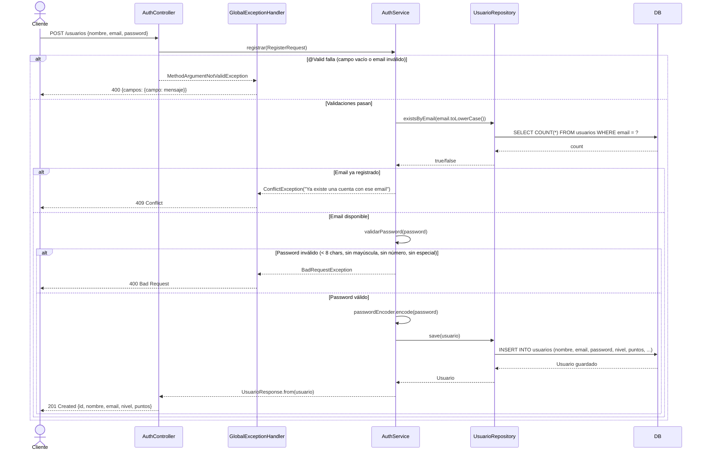

---

## HU02 – Inicio de sesión

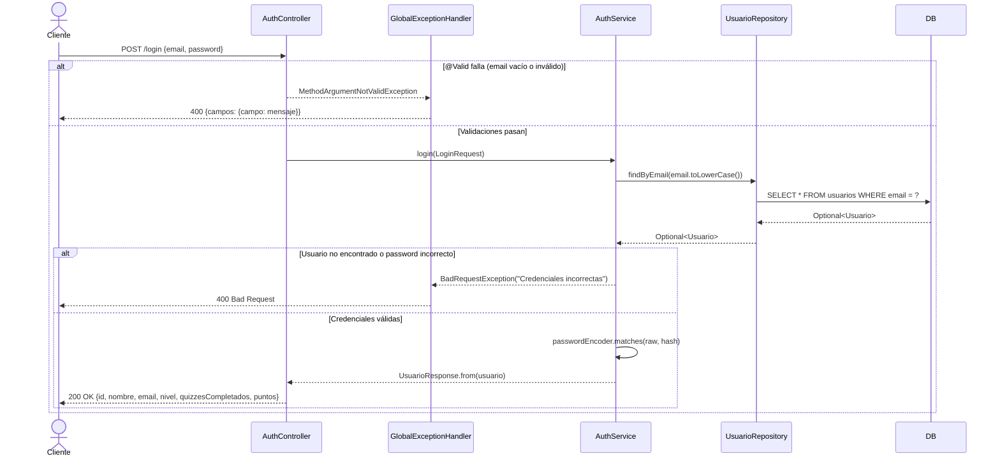

---

## HU03 – Visualización de tablero Scrum

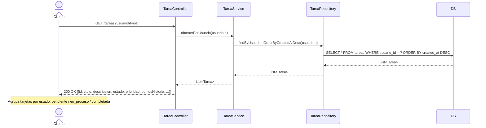

---

## HU04 – Movimiento de tareas (Drag & Drop)

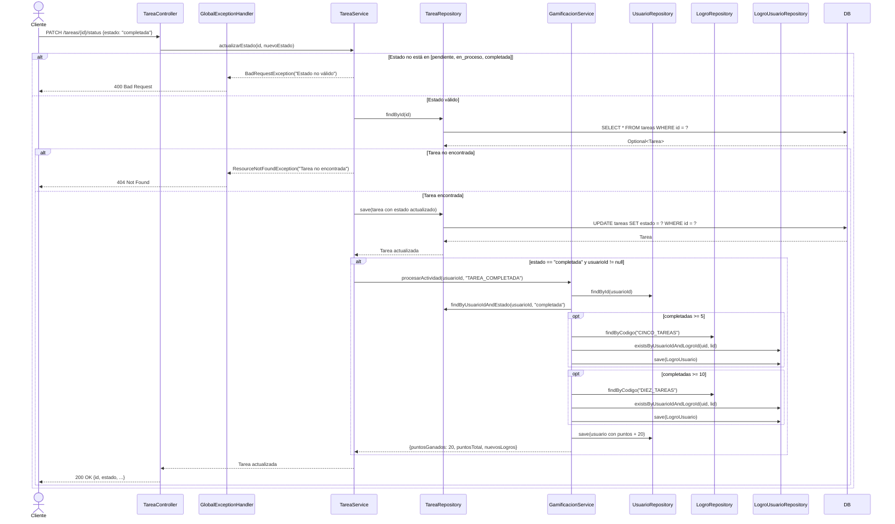

---

## HU05 – Contenido educativo en tarjetas

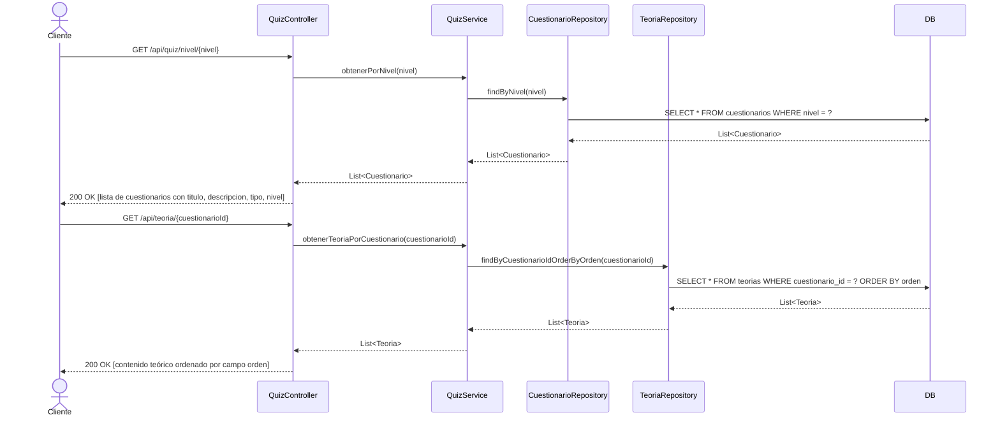

---

## HU06 – Evaluación mediante quizzes

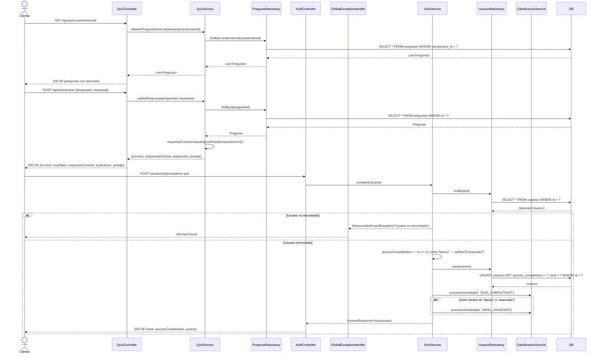

---

## HU07 – Seguimiento de progreso

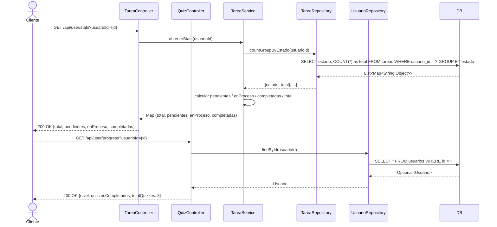

---

## HU08 – Visualización de tareas en tiempo real

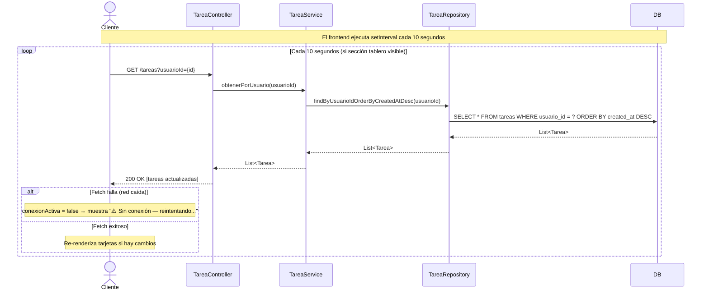

---

## HU09 – Gestión de tareas (CRUD)

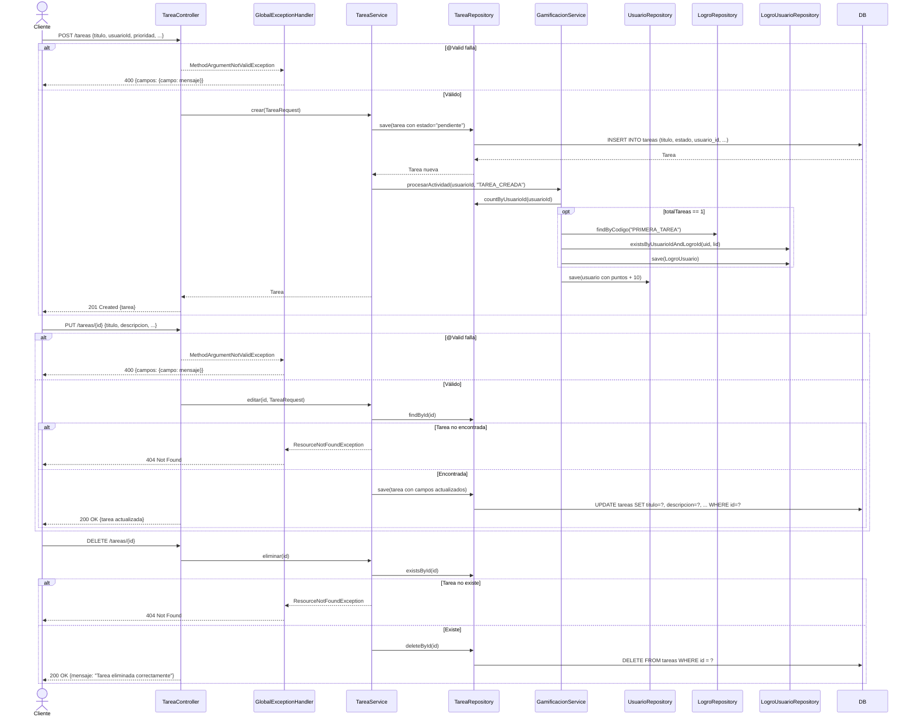

---

## HU10 – Reportes y estadísticas

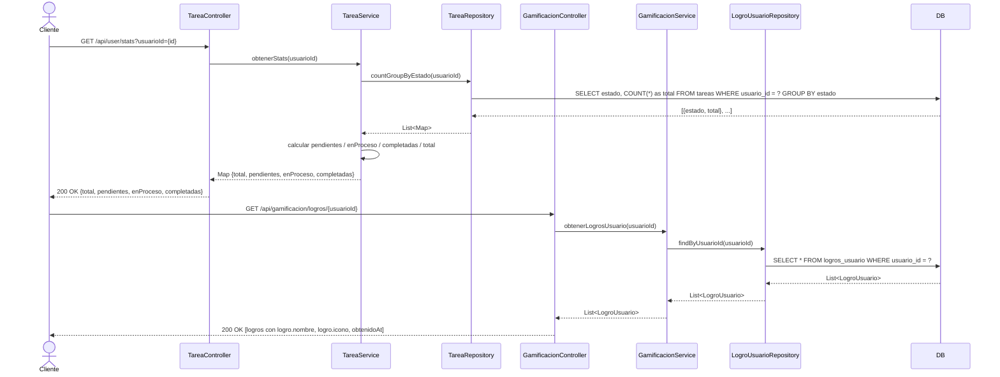

---

## HU11 – Niveles de aprendizaje

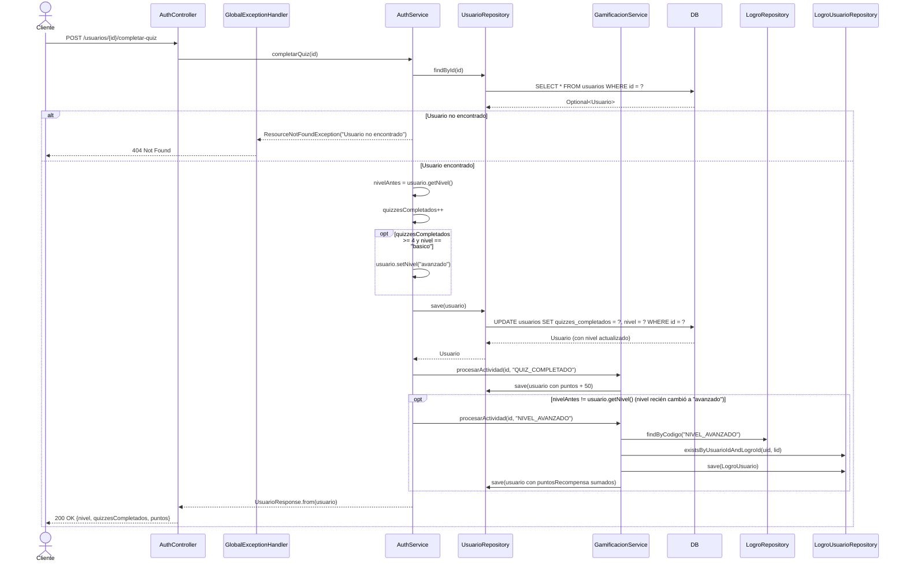

---

## HU12 – Retroalimentación en tiempo real

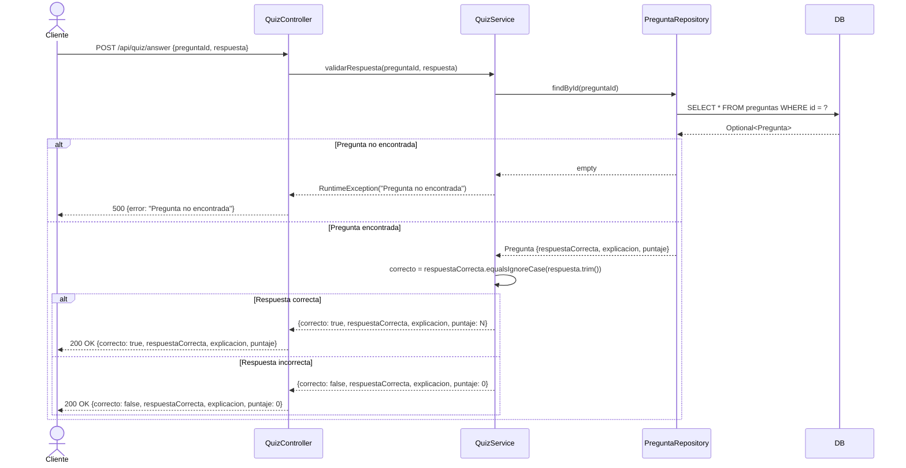

---

## HU13 – Simulación de sprint

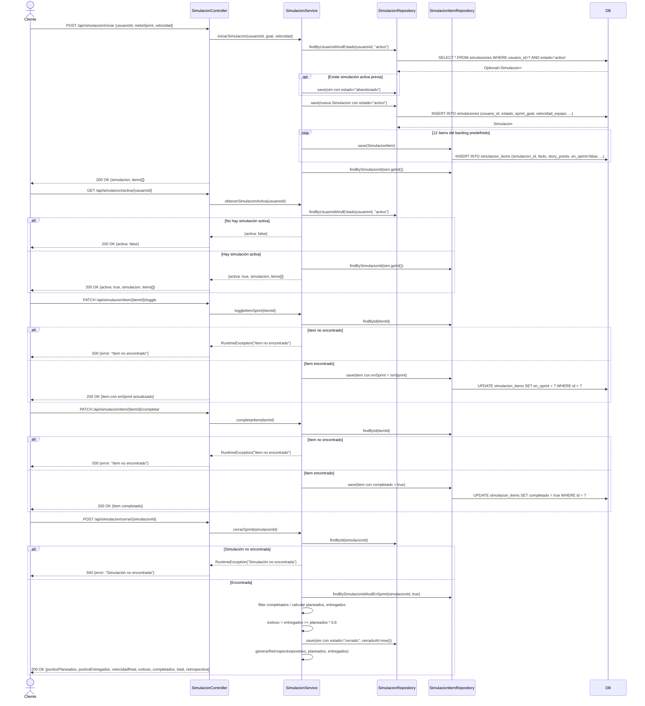

---

## HU14 – Modo oscuro

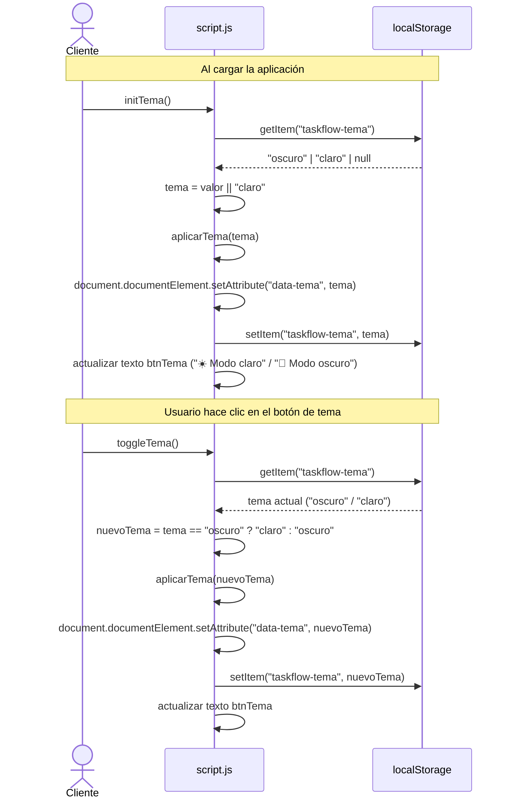

---

## HU15 – Gamificación

```mermaid
sequenceDiagram
    actor Cliente
    participant GamificacionController
    participant GamificacionService
    participant UsuarioRepository
    participant TareaRepository
    participant LogroRepository
    participant LogroUsuarioRepository
    participant DB

    Cliente->>GamificacionController: POST /api/gamificacion/actividad {usuarioId, tipo}
    GamificacionController->>GamificacionService: procesarActividad(usuarioId, tipoActividad)
    GamificacionService->>UsuarioRepository: findById(usuarioId)
    UsuarioRepository->>DB: SELECT * FROM usuarios WHERE id = ?
    DB-->>UsuarioRepository: Usuario
    UsuarioRepository-->>GamificacionService: Usuario

    alt tipoActividad == "TAREA_CREADA" (+10 pts)
        GamificacionService->>TareaRepository: countByUsuarioId(usuarioId)
        TareaRepository->>DB: SELECT COUNT(*) FROM tareas WHERE usuario_id = ?
        DB-->>TareaRepository: totalTareas
        opt totalTareas == 1
            GamificacionService->>LogroRepository: findByCodigo("PRIMERA_TAREA")
            LogroRepository->>DB: SELECT * FROM logros WHERE codigo = ?
            DB-->>LogroRepository: Optional<Logro>
            GamificacionService->>LogroUsuarioRepository: existsByUsuarioIdAndLogroId(uid, lid)
            LogroUsuarioRepository->>DB: SELECT COUNT(*) FROM logros_usuario WHERE ...
            DB-->>LogroUsuarioRepository: false (no otorgado)
            GamificacionService->>LogroUsuarioRepository: save(LogroUsuario)
            LogroUsuarioRepository->>DB: INSERT INTO logros_usuario (...)
            GamificacionService->>GamificacionService: usuario.setPuntos(puntos + puntosRecompensa) [en memoria]
        end
    else tipoActividad == "TAREA_COMPLETADA" (+20 pts)
        GamificacionService->>TareaRepository: findByUsuarioIdAndEstado(usuarioId, "completada")
        TareaRepository->>DB: SELECT * FROM tareas WHERE usuario_id=? AND estado='completada'
        DB-->>TareaRepository: List<Tarea>
        opt completadas >= 5
            GamificacionService->>LogroRepository: findByCodigo("CINCO_TAREAS")
            GamificacionService->>LogroUsuarioRepository: existsByUsuarioIdAndLogroId(uid, lid)
            GamificacionService->>LogroUsuarioRepository: save(LogroUsuario)
            GamificacionService->>GamificacionService: usuario.setPuntos(puntos + puntosRecompensa) [en memoria]
        end
        opt completadas >= 10
            GamificacionService->>LogroRepository: findByCodigo("DIEZ_TAREAS")
            GamificacionService->>LogroUsuarioRepository: existsByUsuarioIdAndLogroId(uid, lid)
            GamificacionService->>LogroUsuarioRepository: save(LogroUsuario)
            GamificacionService->>GamificacionService: usuario.setPuntos(puntos + puntosRecompensa) [en memoria]
        end
    else tipoActividad == "QUIZ_COMPLETADO" (+50 pts)
        GamificacionService->>GamificacionService: quizzes = usuario.getQuizzesCompletados()
        opt quizzes == 1
            GamificacionService->>LogroRepository: findByCodigo("PRIMER_QUIZ")
            GamificacionService->>LogroUsuarioRepository: existsByUsuarioIdAndLogroId(uid, lid)
            GamificacionService->>LogroUsuarioRepository: save(LogroUsuario)
            GamificacionService->>GamificacionService: usuario.setPuntos(puntos + puntosRecompensa) [en memoria]
        end
        opt quizzes >= 4
            GamificacionService->>LogroRepository: findByCodigo("TODOS_BASICO")
            GamificacionService->>LogroUsuarioRepository: existsByUsuarioIdAndLogroId(uid, lid)
            GamificacionService->>LogroUsuarioRepository: save(LogroUsuario)
            GamificacionService->>GamificacionService: usuario.setPuntos(puntos + puntosRecompensa) [en memoria]
        end
        opt quizzes >= 8
            GamificacionService->>LogroRepository: findByCodigo("TODOS_AVANZADO")
            GamificacionService->>LogroUsuarioRepository: existsByUsuarioIdAndLogroId(uid, lid)
            GamificacionService->>LogroUsuarioRepository: save(LogroUsuario)
            GamificacionService->>GamificacionService: usuario.setPuntos(puntos + puntosRecompensa) [en memoria]
        end
    else tipoActividad == "NIVEL_AVANZADO" (+0 pts)
        GamificacionService->>LogroRepository: findByCodigo("NIVEL_AVANZADO")
        GamificacionService->>LogroUsuarioRepository: existsByUsuarioIdAndLogroId(uid, lid)
        GamificacionService->>LogroUsuarioRepository: save(LogroUsuario)
        GamificacionService->>GamificacionService: usuario.setPuntos(puntos + puntosRecompensa) [en memoria]
    end

    GamificacionService->>GamificacionService: usuario.setPuntos(puntos + puntosGanados) [en memoria]
    GamificacionService->>UsuarioRepository: save(usuario) [único save al final]
    UsuarioRepository->>DB: UPDATE usuarios SET puntos = ? WHERE id = ?
    GamificacionService-->>GamificacionController: {puntosGanados, puntosTotal, nuevosLogros[]}
    GamificacionController-->>Cliente: 200 OK {puntosGanados, puntosTotal, nuevosLogros}
```
